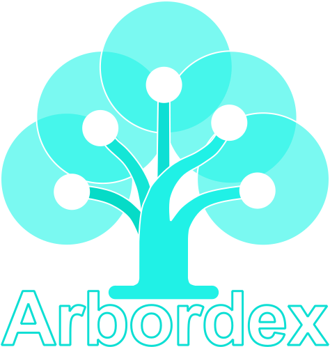
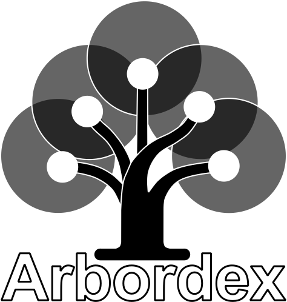
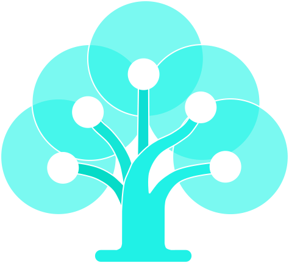
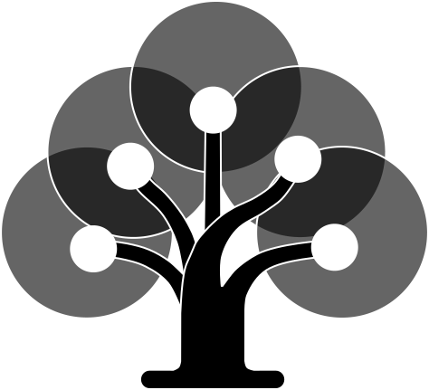
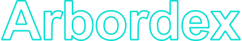

# Arbordex Logo Files

Official, regenerated SVG assets with consistent IDs, styling, and sizing.

## Files at a Glance

| Primary logo | Mono logo | Mark (cyan) | Mark (bw) | Wordmark (cyan) | Wordmark (bw) |
| --- | --- | --- | --- | --- | --- |
|  |  |  |  |  |  |

### Available SVGs

- `arbordex.svg`  -  Full cyan lockup (legacy name, same art as `arbordex-logo-cyan.svg`)
- `arbordex-logo-cyan.svg`  -  Primary color logo
- `arbordex-logo-bw.svg`  -  Monochrome logo for single-color use
- `arbordex-mark-cyan.svg`  -  Cyan mark only (default favicon and app icon)
- `arbordex-mark-bw.svg`  -  Monochrome mark only
- `arbordex-wordmark-cyan.svg`  -  Cyan wordmark for tight horizontal spaces
- `arbordex-wordmark-bw.svg`  -  Monochrome wordmark

## How to Use

### Mark (Icon)

- Use for favicons (default), app icons, social avatars, and tight UI spaces.
- Prefer cyan on light/dark backgrounds; use bw only when single-color is required (print, emboss, laser).
- Keep at 16–128px in digital contexts; avoid replacing text in sentences.
- Do not recolor, outline, or place inside shapes; avoid adding gradients/effects.

### Wordmark

- Use when text clarity matters and the mark would be too small (nav bars, footers, thin headers).
- Pair with the mark only when you have horizontal space; keep consistent spacing.
- Minimum width 120px digital; avoid below 10pt in print.
- Do not stack letters, warp, or track tightly; avoid overlaid photos with low contrast.

### Full Logo

- Use `arbordex-logo-cyan.svg` for most surfaces; choose bw only for single-ink or emboss.
- Minimum width 150px digital, 0.75" in print; maintain aspect ratio.
- Keep 8px clear space on all sides (or height of the “A” when scaled up).

## Do / Don’t (visual)

| Do | Don’t |
| --- | --- |
|  |  |
| Use approved cyan on clean, high-contrast backgrounds. | Don’t recolor outside the approved palette. |
|  |  |
| Use the mark alone for favicons, avatars, and small UI. | Don’t add extra outlines, borders, or containers. |

## Quick Specs

- **Format:** SVG (vector, infinitely scalable)
- **Minimum sizes:** Mark 16px (favicon), Logo 150px (digital), Wordmark 120px (digital)
- **Clear space:** ≥ 8px (or the height of the “A” at your chosen size)
- **Palette:** Cyan `#00FFFF`, Black `#000000`, White `#FFFFFF` only

For the full brand system, see [../BRAND.md](../BRAND.md).
